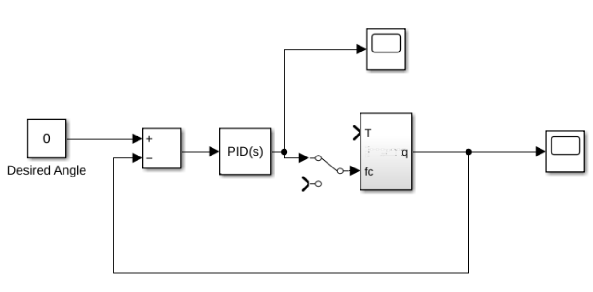
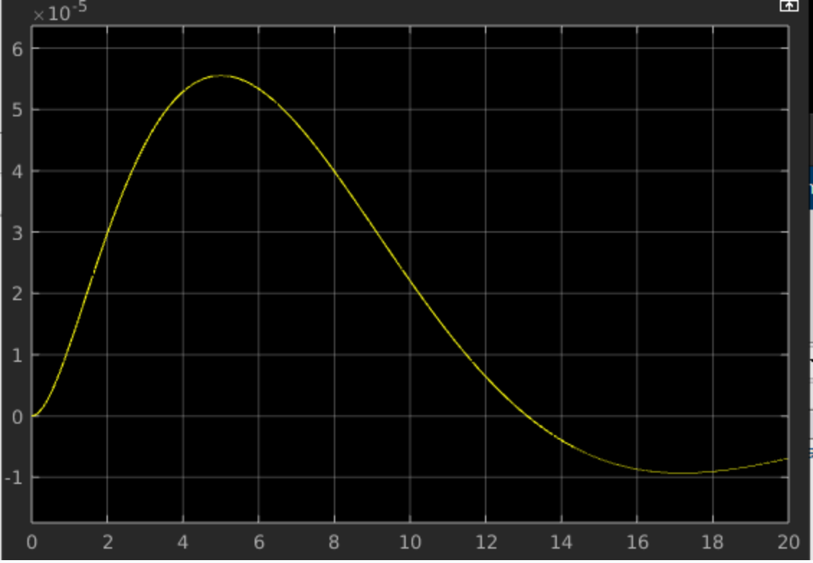
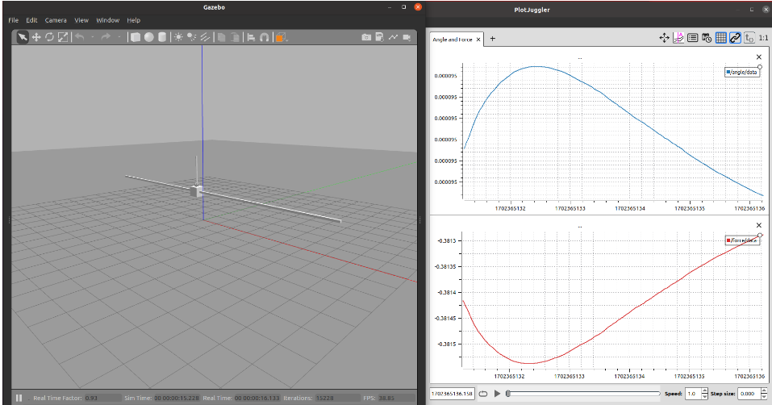

# inverted_pendulum
Simulation files for the inverted pendulum in Matlab and ROS

Simulink:

Angle Response in Matlab:

Controlled Simulation in ROS2 Gazeebo:


## Requirements
[Plotjuggler](https://github.com/facontidavide/PlotJuggler) is required in order to visualize the topics. 

## Usage
Navigate to the *ros2_ws* directory and run the following:
```
colcon build --symlink-install
source install/setup.bash
ros2 launch inverted_pendulum sdf.launch.py 
```
The PID controller is programmed in *ros2_ws/src/inverted_pendulum/src/pid_controller.cpp*

